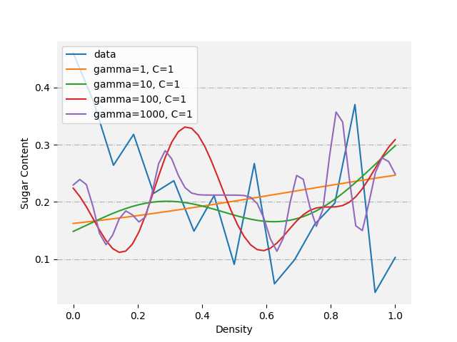
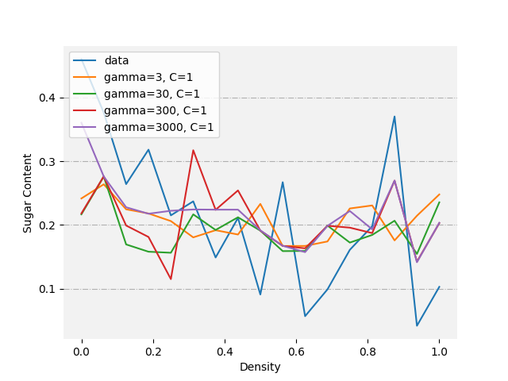

# Support-Vector-Machine
在西瓜3.0数据集上做支持向量机和libsvm

## 方法
使用svr模型以及libsvm对西瓜3.0数据集上进行处理

其中通过西瓜的密度来预测西瓜的含糖量

## 安装环境
```
pip install -U libsvm-official
pip install Scikit-learn matplotlib 
```

## 效果展示
**svr**



**libsvm**


